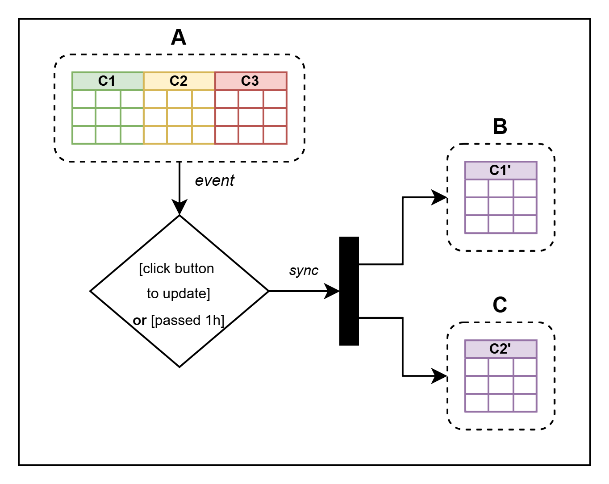

# Sincronização de Planilhas com AppScript

Este é um projeto que fiz usando AppScript e planilhas do Google.

Ele é uma proposta de sincronização de planilhas baseado em uma planilha central.

A ideia principal é que dado a planilha A, caso haja um evento de click ou se passado 1h, as planilhas filha, B e C, serão sincronizadas de acordo com o que tem na planilha A.
